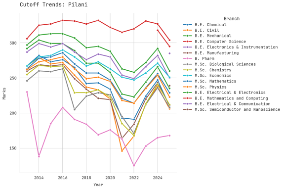
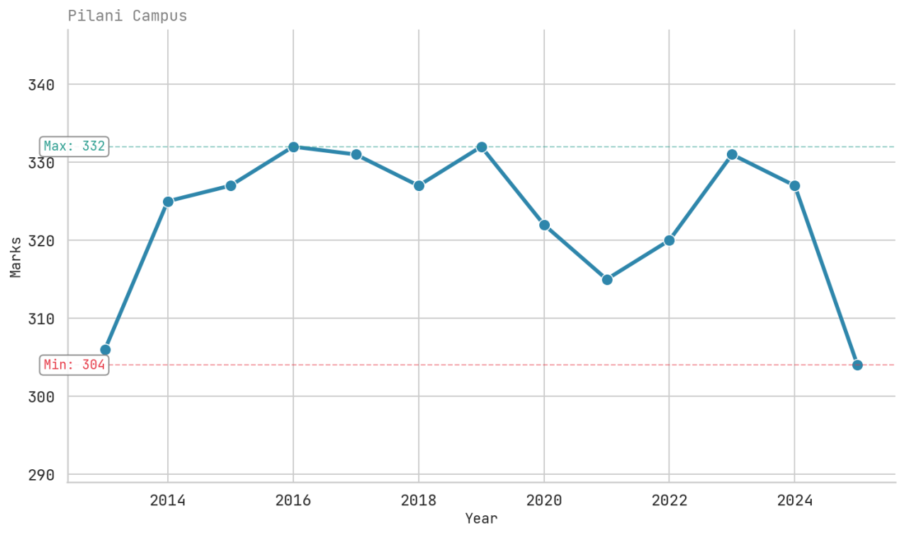
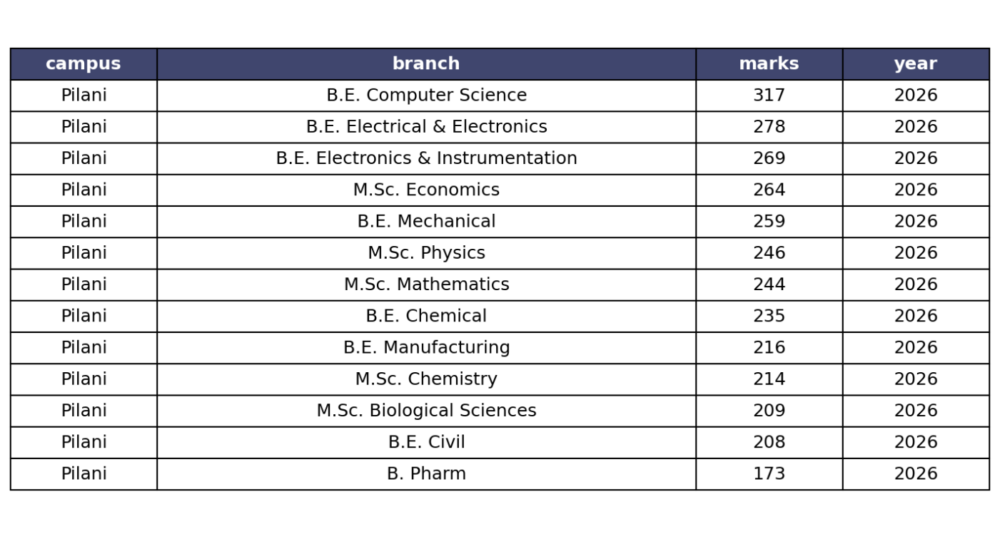

# Introducing Bitsatards-Bot

This src aims to be the discord bot for r/Bitsatards server, this bot serves the purpose of predicting cutoffs for upcoming bitsat examinations on basis of past-year trends (taking account from 2013) and can supports all of the commands which was planned in the second release (9/1/26):

| Category | Command | Usage Example | Description |
| :--- | :--- | :--- | :--- |
| **Data Viz** | `!!plot` | `!!plot Pilani` | Generates a trend plot for all branches in a specific campus. |
| | `!!plot-branch` | `!!plot-branch CSE Pilani` | Plots historical cutoffs for a specific branch at a specific campus. |
| | `!!select` | `!!select 2024 Goa` | Fetches and displays a snapshot of cutoffs for a specific year. |
| **Predictions** | `!!predict` | `!!predict Pilani worst` | Returns 2026 predictions based on Worst, Best, or Most-Likely scenarios. |
| **Exam Info** | `!!sy` | `!!sy` | Provides the official BITSAT syllabus PDF link. |
| | `!!da` | `!!da` | Displays important dates for BITSAT 2026 Session 1 & 2. |
| | `!!resources` | `!!resources` | Links to the Reddit wiki and curated Discord resource channels. |
| **Tracking** | `!!time` | `!!time` | Shows a countdown to your saved exam date. |
| | `!!time -s` | `!!time -s 15-04-2026` | Sets/Updates your personal BITSAT exam date. |
| | `!!time -r` | `!!time -r` | Resets your saved exam date from the database. |
| **Misc** | `!!ypt` | `!!ypt` | Shares the Yeolpumta (YPT) study group link and password. |

Currently the bot is deployed through my second laptop which doubles as a server purely to run programs 24/7 to avoid any middleman (cloud service providers) and charges.

## Results Thus Far!

*Pilani campus plot from 2013*

------------------------------------------------------------------------------

*CSE plot for Pilani from 2013*

------------------------------------------------------------------------------

*probable values for Pilani campus in 2026*

The model in effect for prediction is a polynomial-regression of degree:2, this approach provided the lowest mean squared error compared to other linear/ensemble approaches.

> [!NOTE]
> I would like to clarify that this acts more as a statistical-validator than a plain machine-learning model as not much variance factors and features have been computed yet (discussed below).

## Tech Stack

## Future Plans

There are plans to experiment by finding causation and co-relations with cutoffs of other entrance examinations such as: JEE however I don't think I will be able to complete it in time of announcement of this project.

The dataset is as follows for to work with: [dataset](!https://www.kaggle.com/datasets/pranavunni/bitsat-cutoff-dataset-2017-2025) for anyone willing to have their own spin-off to this.

By mid-february 2026:

1. a general-purpose website will be made public for everyone, in specific targetting people who prefer not using discord (We are almost there!)

After public-announcement & promotion, I will be back to implement various features and factors I have pinpointed thus far which can help in model-predictions more than anything.

> ## Contributing
> This project is developed hoping to be a community effort. If you'd like to improve the model or add features, please check our [CONTRIBUTING.md](./CONTRIBUTING.md) for general guidelines.
> 
> ---
> *Licensed under Apache 2.0*

<a href="https://star-history.com/#PranavU-Coder/bitsatards_bot&Date">
 <picture>
   <source media="(prefers-color-scheme: dark)" srcset="https://api.star-history.com/svg?repos=PranavU-Coder/bitsatards_bot&type=Date&theme=dark" />
   <source media="(prefers-color-scheme: light)" srcset="https://api.star-history.com/svg?repos=PranavU-Coder/bitsatards_bot&type=Date" />
   
 </picture>
</a>

Contributors till now:

Made with [contrib.rocks](https://contrib.rocks).